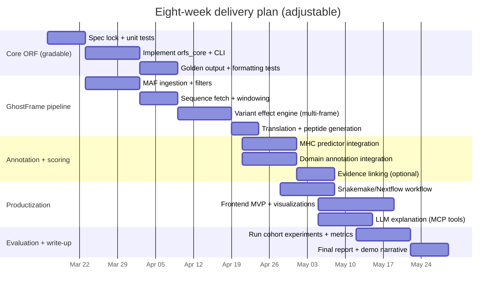

# Ambitious Cancer-Focused Bioinformatics Group Project Options With a Professor-Gradable ORF Core

## Executive summary

This report proposes project options for a 3-person bioinformatics master’s group that **must** include a professor-gradable core Python module implementing an ORF-finder assignment (FASTA parsing, 6-frame scanning including reverse complement, maximal ATG→stop ORFs, minimum-length filter default 50, exact FASTA-style output with `FRAME/POS/LEN`, codon spacing, and 15 codons per line), and **extends** that core into an ambitious, cancer-focused pipeline designed to produce “shock appeal” results and fill a practical integration gap not typically offered as a single, end-to-end product by ["organization","NCBI","us bioinformatics institute"] or ["organization","EMBL-EBI","european bioinformatics institute"].  

The strongest, most feasible “shock” concept is a **Silent→Not-Silent Reclassifier** (“GhostFrame”): take somatic variants labeled “Silent” in open cancer mutation files and show that, under a **multi-frame** ORF view, some of these variants become missense/stop/start-loss in **overlapping or noncanonical ORFs**, then prioritize the resulting mutant peptides as potential **noncanonical neoantigens** using ["organization","MHCflurry","mhc-i predictor openvax"] or ["organization","NetMHCpan","mhc-i predictor dtu"]. This is strongly motivated by published results: ["organization","OpenVar","variant annotator noncanonical orfs"] showed that including noncanonical ORFs can dramatically increase “high-impact” variant calls versus conventional annotators on a cancer synonymous-mutation dataset, and highlighted clustering of variants in a dual-coding region in HEY2.  

As a fast, highly demonstrable second option, an **oncogenic virus dual-coding** pipeline (“OncoVirus Dual-Coding”) uses the same ORF core on compact viral genomes (e.g., HPV16 reference K02718.1), where overlapping ORFs are common and outputs are easy to validate; HPV16/18 are classified as carcinogenic to humans (Group 1) in IARC evaluations.  

Because your goal is “industry-modern” reproducibility and delivery, each concept is designed as a small, gradable ORF module plus a reproducible workflow layer via ["organization","Snakemake","workflow engine"] or ["organization","Nextflow","workflow engine"] with container/conda environments.  

## Evidence landscape and where “the gap” really is

### Noncanonical ORFs are real and systematically underused in variant interpretation

OpenVar frames the core scientific issue: thousands of functional ORFs exist outside reference annotations, including ORFs that overlap annotated coding regions in other frames; a key barrier has been software that can interpret variants in dual-coding regions.  

["organization","OpenProt","alternative orf resource"] 2.0 positions itself as a proteogenomic resource providing a complete, freely accessible set of alternative ORFs (AltORFs) and functional annotations for proteins not present in conventional databases (e.g., RefSeq/Ensembl).  

### “Silent” mutations in cancer are not necessarily biologically silent

["organization","SynMICdb","synonymous mutations cancer db"] provides a large, curated resource of somatic synonymous mutations in cancer (reported as 659,194 in the paper), including recurrence, alternative events, and a SynMICdb score, which underpins the rationale for focusing on “Silent” variants as a high-yield, shock-friendly starting point.  

OpenVar used SynMICdb as its demonstration dataset and reported large increases in “high impact” variants when noncanonical ORFs are included, compared with common annotators, illustrating the magnitude of the blind spot.  

### Noncanonical antigens are a growing immuno-oncology theme

Recent reviews emphasize “cryptic” and noncanonical antigens as promising targets for precision immunotherapy and next-generation cancer vaccines.  

On the methods side, ["organization","NovumRNA","noncanonical tumor antigen pipeline"] is a Nextflow pipeline for predicting multiple classes of noncanonical tumor-specific antigens from RNA-seq, demonstrating that the field treats ncTSAs as a concrete computational target, not a speculative concept.  

### Why an end-to-end student project can still be “novel”

Pieces exist (noncanonical ORF resources, neoantigen predictors, visualization tools), but there is still room for a **bridging product** that is:
- strict about an ORF-finder core (gradable),
- “sequence-first” (can run on any FASTA, including viruses or custom regions),
- “variant-first” (reinterprets Silent/low-impact calls under a multi-frame model),
- “immune-first” (prioritizes peptides with MHC presentation predictors),
- “human-friendly” (frontend + traceable LLM explanations).

This integration-heavy gap is consistent with why tools like OpenVar/OpenCustomDB/NovumRNA were built to “fill the gap” in their respective subproblems (variant effects in altORFs; sample-specific alt-proteome databases; ncTSA prediction pipelines).  

## Recommended concepts and comparison of alternatives

### Ranked recommendations by novelty, feasibility, and impact

Scoring rubric (1–5): **Novelty**, **Feasibility**, **Impact**.

**GhostFrame: Silent→Not-Silent multi-frame reclassification + noncanonical neoantigen prioritization**  
- Novelty: 5 (turns a familiar assumption into a measurable, pipeline-driven finding)  
- Feasibility: 4 (works with open-access MAFs + targeted genome windows; MHCflurry is open-source and integrates cleanly)  
- Impact: 5 (produces interpretable “case studies” and ranked candidate lists; grounded in published reclassification effects)  

**OncoVirus Dual-Coding: overlapping ORFs in oncogenic viruses + peptide prioritization**  
- Novelty: 4 (viral dual-coding + immune scoring is a strong demo story and maps naturally to 6-frame ORF logic)  
- Feasibility: 5 (small FASTAs, low compute, fast iteration)  
- Impact: 4 (clear narrative; strong visuals; avoids some complexity of human genome coordinate extraction)  

**Hotspot Dual-Coding Atlas: pan-cancer enrichment of variants in overlapping ORF regions**  
- Novelty: 4 (statistical enrichment and “hidden hotspot” stories like HEY2)  
- Feasibility: 3 (needs careful cohort selection and coordinate extraction)  
- Impact: 4 (produces a set of candidate dual-coding loci and enrichment statistics)  

### Required comparison table of 4–6 alternative ideas

| Idea | Novelty | Feasibility | Data availability | Grading risk (core) | Shock appeal | Estimated dev time |
|---|---:|---:|---:|---:|---:|---|
| GhostFrame: Silent→Not-Silent multi-frame + neoantigens | 5 | 4 | 4 | 2 | 5 | 6–8 weeks |
| OncoVirus Dual-Coding + neoantigens | 4 | 5 | 5 | 2 | 4 | 5–7 weeks |
| Pan-cancer dual-coding hotspot/enrichment atlas | 4 | 3 | 4 | 2 | 4 | 7–9 weeks |
| “OpenCustomDB-lite”: alt-proteome DB + variant peptides (no MS) | 3 | 3 | 3 | 2 | 3 | 7–10 weeks |
| ncTSA-lite inspired by NovumRNA (no FASTQ alignment) | 4 | 3 | 3 | 2 | 4 | 8–10 weeks |
| Viral–human chimeric ORF/neoantigen finder (integration breakpoints) | 5 | 2 | 2 | 2 | 5 | 10–12 weeks |

Notes:
- “Grading risk (core)” stays low if you hard-isolate the ORF assignment deliverable as a standalone module with tests and a fixed output spec.
- Data availability is highest for open viral reference FASTAs and open-access cohort mutation files; it decreases for fusion/integration breakpoints and matched RNA-seq without dedicated compute.  

## The professor-gradable ORF core module

### Contract: what the professor grades and what the pipeline reuses

Deliver **two layers**:

1. **`orfs` CLI program** (professor-facing)
   - Reads a multi-sequence FASTA file
   - Prompts for minimum ORF length (default 50 bases)
   - Prints ORFs in FASTA format exactly as specified:  
     `>original_header | FRAME = N POS = P LEN = L`  
     then DNA with spaces between codons and <=15 codons/line.

2. **`orfs_core` library** (pipeline-facing)
   - Returns structured ORF records: `{seq_id, frame, start_idx, end_idx, pos_value, length_bp, dna_seq, strand}`
   - Provides deterministic formatting functions used by the CLI

This separation protects grading while enabling ambitious extensions.

### Implementation details that tend to break grading

**FASTA parsing pitfalls to test explicitly**  
- multiple sequences per file with headers `>`  
- sequences split over many lines  
- whitespace anywhere in sequence lines must be ignored  
- mixed case must be normalized (e.g., uppercase internally)

**6-frame scanning**  
- Frames 1–3: forward strand offsets 0/1/2  
- Frames 4–6: reverse complement, offsets 0/1/2 on the reverse-complemented string

**Maximal ORF definition**  
- Start codon: ATG  
- Stop codons: TAA, TAG, TGA  
- ORF is maximal within the frame: read codons from start until the first in-frame stop; output inclusive stop codon (as in the assignment example).

**Position conventions**  
- Forward frames: `POS = start_index_forward + 1` (1-based)  
- Reverse frames: if ORF starts at reverse-complement index `j` (0-based), `POS = -(j+1)` representing “position from the right end” (rightmost base is -1). This mirrors the assignment rule and is easy to unit test.

### Core test plan (minimal but high confidence)

- **Golden tests**: small synthetic sequences where you can precompute ORFs by hand (including reverse complement frames).  
- **Formatting tests**: ensure 15 codons/line, codon spacing, header format string equality.  
- **Edge tests**: ORFs at sequence boundaries; sequences with no stop codon; overlapping start codons; stop codons immediately following start.

## End-to-end pipeline architectures that map the core to cancer deliverables

### GhostFrame architecture (recommended)

Core idea: variants labeled “Silent” in standard annotations can become non-silent under a multi-frame ORF model, consistent with the OpenVar motivation and findings.  

```mermaid
flowchart TD
  A[Input: MAF/VCF from open cancer cohort] --> B[Filter: keep Silent / low-impact]
  B --> C[Coordinate normalization + allele handling]
  C --> D[Sequence fetch: reference window or provided FASTA]
  D --> E[orfs_core: 6-frame ORF discovery]
  E --> F[Effect engine: does variant change codon in each overlapping ORF?]
  F --> G[Translate affected ORFs -> proteins]
  G --> H[Generate mutant peptides 8-11mers]
  H --> I[MHC prediction: MHCflurry or NetMHCpan]
  G --> J[Domain/functional annotation: HMMER/Pfam or InterProScan]
  F --> K[Evidence linking: OpenProt + SynMICdb + ClinVar (+ optional OncoKB/COSMIC)]
  I --> L[Rank + explain]
  J --> L
  K --> L
  L --> M[Outputs: report, JSON provenance, UI artifacts]
  M --> N[Frontend + LLM explainer via tool calls]
```

**Why this is not “just NCBI/EBI”**  
- It is deliberately focused on **reinterpreting the Silent bucket** into “protein-impacting under alternative ORFs,” which is exactly the blind spot OpenVar highlights (and quantifies) but you can operationalize into a modern, explainable report with neoantigen scoring and a UI.  
- It couples variant reclassification to immune prioritization with established predictors (NetMHCpan, MHCflurry) whose methods and benchmarking are published and documented.  

### OncoVirus Dual-Coding architecture (fast, high demo value)

Use HPV16 reference FASTA (K02718.1) plus either synthetic mutations or published variant sets to demonstrate overlapping ORF impacts and candidate peptides, grounded in the fact HPV16/18 are carcinogenic in IARC evaluations.  

This option is strongest when you want:
- very fast correctness validation of ORF calling across both strands,
- crisp visualizations (circular/linear genome maps),
- low compute requirements.

### Workflow and reproducibility layer

- Snakemake: described as reproducible and scalable with a Python-based workflow language and automatic software deployment to environments.  
- Nextflow: described as enabling scalable, portable workflows and integrating reproducible containers and Git-based sharing.  

## Public datasets and reproducible examples

### Open-access cohort-level mutation files

The ["organization","Genomic Data Commons","nci cancer data portal"] documents that MAF files exist at two permission levels: protected and somatic/open-access. The Cohort Level MAF tool is explicitly designed to select and download open-access MAFs for a cohort.  

Automation options:
- GDC API “files” endpoint example for retrieving MAF file metadata.  
- Data Transfer Tool download by manifest; tokens are needed for controlled-access downloads.  

Important caveat: a GDC user guide notes that open-access MAFs can omit some validated somatic mutations due to conservative filtering, and suggests reviewing protected MAFs when necessary.  

### Synonymous-mutation datasets for the “Silent→Not-Silent” story

SynMICdb is a dedicated resource for synonymous mutations in cancer with recurrence and additional annotations, providing a natural target dataset for reclassification experiments.  

OpenVar specifically analyzed SynMICdb and highlighted dual-coding enrichment in HEY2, giving you a published “anchor” example for narrative and evaluation.  

### Viral reference FASTA for OncoVirus Dual-Coding demos

- HPV16 complete genome is publicly available as GenBank K02718.1 (7,904 bp).  
- HPV16/18 carcinogenic classification and related IARC summaries are available through IARC/NCBI Bookshelf sources.  
- ["organization","PaVE","papillomavirus episteme niaid"] provides curated papillomavirus references and visualization tools, including HPV16 transcript maps.  

### Practical “starter cohorts” for a 3-person team

To avoid overreach without a guaranteed compute budget:
- Use one GDC tumor project MAF open-access file (or Cohort Level MAF export) and restrict analysis to a subset (e.g., “Silent” variants in top recurrent genes or in a few chromosomes).
- Use HPV16 FASTA as a parallel demo path that always runs quickly.

## Tooling, installation/licensing notes, and integration examples

### Prioritized tool stack

**Workflow and packaging**
- Snakemake: reproducible/scalable workflows, Python-based.  
- Nextflow: portable workflows, container integration and sharing practices.  

**Variant + cohort data**
- GDC Cohort Level MAF tool (UI).  
- GDC API and Data Transfer Tool.  

**Neoantigen and immune scoring**
- NetMHCpan-4.1: published improvements via integration of MS eluted ligand data and motif deconvolution; benchmarked against other methods in the NAR paper.  
- NetMHCpan academic download restrictions noted on the DTU download page.  
- MHCflurry: open-source package with CLI and Python interfaces; published in 2018 and extended (presentation/processing) in 2020.  

**Domain/functional annotation**
- ["organization","InterPro","protein family domain resource"] provides functional analysis/classification; InterProScan requirements and licensing are documented (Apache License; signature collections may have differing terms).  
- ["organization","HMMER","profile hmm search suite"] is profile-HMM based; its User Guide states BSD 3-clause distribution.  
- ["organization","Pfam","protein family database"] is available under CC0 per official Pfam/InterPro docs.  

**Evidence linking (with licensing caution)**
- ClinVar: publicly accessible archive of human variation with disease/drug response assertions and supporting evidence.  
- OncoKB: terms/licensing indicate programmatic access requires approval/token; terms restrict use without license agreement.  
- COSMIC: terms describe academic/non-commercial permitted use conditions (license terms apply; check the current terms).  

### CLI examples (copy/paste ready)

```bash
# ORF core (professor-gradable)
python -m orfs --input input.fasta > orfs_out.fasta
# (If --min-len not provided, prompt user; default must be 50)

# Snakemake run (reproducible)
snakemake --use-conda --cores 8

# Nextflow run (containerized profile assumed)
nextflow run main.nf -profile docker

# MHCflurry predictions from a CSV with peptides + alleles
mhcflurry-predict INPUT.csv --out mhcflurry_results.csv

# NetMHCpan (example shape; exact flags depend on your install)
netMHCpan -a HLA-A02:01 -p peptides.faa > netmhcpan.out

# HMMER hmmscan against Pfam HMMs
hmmscan --tblout pfam.tbl Pfam-A.hmm proteins.faa

# InterProScan (tsv output, add GO terms if needed)
interproscan.sh -i proteins.faa -f tsv -goterms -pa -dp
```

The MHCflurry CLI behavior and output options are documented in its command-line reference. NetMHCpan-4.1 method description and training data scale are documented on the service page, and its benchmarking is described in the NAR paper. InterProScan requirements (RAM/CPU) are documented in its installation requirements. HMMER’s guide documents its licensing and role.  

### Python integration snippets (subprocess wrapper pattern)

```python
import subprocess
from pathlib import Path

def run_cmd(cmd: list[str], cwd: str | None = None) -> None:
    p = subprocess.run(cmd, cwd=cwd, capture_output=True, text=True)
    if p.returncode != 0:
        raise RuntimeError(
            f"Command failed: {' '.join(cmd)}\nSTDOUT:\n{p.stdout}\nSTDERR:\n{p.stderr}"
        )

# Example: call hmmscan
run_cmd([
    "hmmscan",
    "--tblout", "pfam.tbl",
    "Pfam-A.hmm",
    "proteins.faa",
])

# Example: call mhcflurry
run_cmd([
    "mhcflurry-predict",
    "peptides.csv",
    "--out", "mhcflurry_results.csv",
])
```

(Interface design note: keep tool execution in a dedicated “runner” module so the LLM-facing layer cannot execute arbitrary commands; see safety guidance below.)

## Evaluation plan, visualizations, LLM patterns, and project plan

### Evaluation plan and metrics for novelty and biological relevance

**Core ORF module correctness (grading-critical)**
- Exact output formatting compliance: header fields and wrapping at 15 codons/line (string-equality tests).
- Frame correctness: known sequences where ORFs exist only in specific frames, including reverse complement frames.
- Coordinate correctness: forward POS (1-based) and reverse POS convention (negative from right end).

**Novelty/insight metrics for GhostFrame**
- Count and rate of “Silent” variants (from MAF `Variant_Classification`) that become:
  - missense in an overlapping ORF,
  - stop-gained in an overlapping ORF,
  - start-lost or stop-lost (if your effect engine supports it).
- Enrichment metrics for overlap regions (e.g., proportion of variants falling in overlap vs expected by length), mirroring the kind of enrichment story OpenVar reported for HEY2.  
- Evidence linkage:
  - Whether the ORF overlaps a known AltORF in OpenProt (if you integrate its downloaded annotation set).
  - Whether variants appear in SynMICdb (for synonymous-focused cohorts).  

**Neoantigen relevance metrics**
- For each reclassified variant/ORF:
  - number of mutant peptides generated (8–11mers),
  - fraction predicted as strong/weak binders by MHC predictor,
  - rank percentile outputs where available.
- Compare against a canonical-only baseline:
  - how many predicted binders are unique to the alternative-ORF interpretation.

NetMHCpan’s published benchmarking and data integration rationale provides an anchor for credibility in MHC scoring. MHCflurry’s open-source and published evolution toward presentation scoring provides a similarly defensible choice when licensing constraints exist.  

### Suggested visualizations and frontend tech

**High-impact “shock” visuals**
- “Silent→Not-Silent” sankey or flow diagram: Silent → (missense / stop-gain / other) by frame.
- Lollipop plots by gene/locus showing where reclassified variants land, inspired by tools such as ["organization","ProteinPaint","st jude variant visualization"] (GDC documents it as a dynamic lollipop chart tool).  
- Neoantigen candidate table with filters similar to the motivation behind ["organization","pVACview","neoantigen visualization tool"], which explicitly targets interactive neoantigen prioritization.  

**Embeddable genome views**
- ["organization","JBrowse 2","genome browser embedded components"] provides embedded components for web apps.  
- ["organization","igv.js","embeddable genome viewer"] runs in-browser and can be embedded with minimal dependencies, per its Bioinformatics paper.  

**Practical stack**
- Backend: FastAPI (Python), a simple job queue (RQ/Celery), and a results store (SQLite/Postgres).  
- Frontend: Next.js or React; embed JBrowse 2 linear view for loci-level context.  

### LLM integration patterns with safety and traceability constraints

If you add an LLM, the highest-value role is **explanation and guided exploration**, not core computation.

**Recommended pattern: tool-driven agent with strict schemas**
- Expose tools like `run_orf_finder`, `reclassify_variant`, `predict_mhc`, `annotate_domains`, `generate_report`.
- The LLM only:
  - selects tools,
  - summarizes outputs with citations to your computed artifacts (not web claims),
  - never executes shell directly.

The ["organization","Model Context Protocol","open tool integration protocol"] spec describes how servers expose tools with schemas that models can invoke.  

**Security and permissioning constraints**
- MCP ecosystem guidance emphasizes tool safety, and reference implementations warn about risk when a server can access internal addresses or sensitive data.  
- Practical guardrails you should implement:
  - allowlist tool names and argument schemas,
  - deny network/file operations unless explicitly needed,
  - run tools in a sandbox/container with least privilege,
  - record every tool call + inputs + outputs in an immutable log for audit.

**Medical safety constraints**
- Prominently state: “Research/education only; not for clinical decision-making.”  
- No PHI ingestion by default; if user uploads anything, treat it as sensitive and keep local (self-hosted LLM) or anonymize/redact before any cloud call.

### Team task split and week-by-week milestones

Assume ~6–8 weeks. Adjust if your course timeline differs.

**Suggested division of labor**



### Key links (direct URLs)

```text
GDC MAF spec: https://docs.gdc.cancer.gov/Data/File_Formats/MAF_Format/
GDC Cohort Level MAF tool: https://docs.gdc.cancer.gov/Data_Portal/Users_Guide/cohortMAF/
OpenVar (PMC): https://pmc.ncbi.nlm.nih.gov/articles/PMC9375913/
SynMICdb (PMC): https://pmc.ncbi.nlm.nih.gov/articles/PMC6562042/
OpenProt 2.0 (NAR): https://academic.oup.com/nar/article/52/D1/D522/7416803
NetMHCpan-4.1 service: https://services.healthtech.dtu.dk/services/NetMHCpan-4.1/
MHCflurry docs: https://openvax.github.io/mhcflurry/
InterProScan: https://www.ebi.ac.uk/interpro/about/interproscan/
Pfam license/docs: https://pfam-docs.readthedocs.io/
HPV16 reference (K02718.1): https://www.ncbi.nlm.nih.gov/nuccore/K02718
MCP tools spec: https://modelcontextprotocol.io/specification/2025-11-25/server/tools
JBrowse embedded components: https://jbrowse.org/jb2/docs/embedded_components/
igv.js paper: https://academic.oup.com/bioinformatics/article/39/1/btac830/6958554
```

